# GhostKey — Production Architecture Diagram Set
### 16 Mermaid Diagrams, Principal-Engineer Depth

This companion document diagrams the architecture from `ghostkey-architecture.md`. Each diagram is scoped to what it's actually showing — I kept explanations tight (bullets, not essays) so 16 full diagrams stay readable as one document rather than becoming 16 separate walls of text. Same engineering call as last time: complete, not padded.

---

## 1. Complete High-Level System Architecture

**Purpose**: End-to-end request and data flow from a user's browser through every architectural layer to persistence, integrations, and observability.

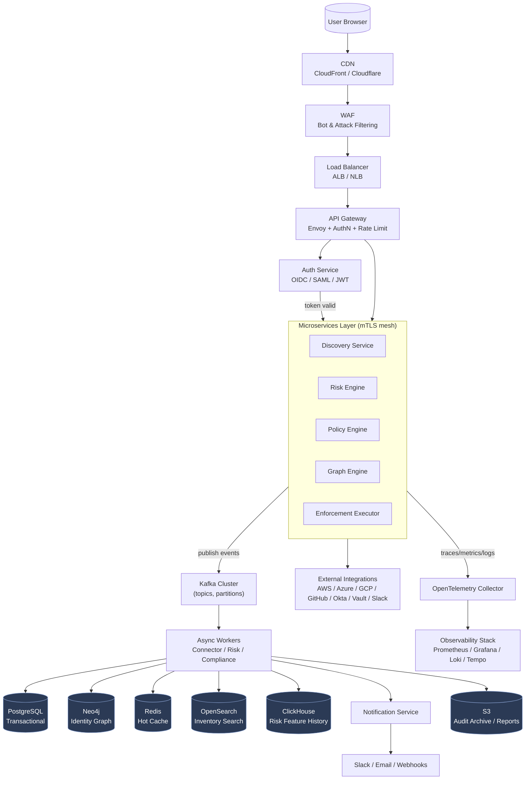

**Explanation**: The browser never talks to services directly — CDN/WAF/LB/Gateway form a defense-in-depth ingress chain before a single line of business logic executes. All service-to-service traffic inside the mesh is mTLS; the gateway is the only mTLS↔public-TLS boundary.

**Request flow**: Browser → CDN (static assets) or → WAF/ALB/Gateway (API calls) → Auth validates JWT/session → routed to owning microservice → service reads/writes Postgres synchronously for the request, publishes an event to Kafka asynchronously for anything else that needs to react.

**Failure handling**: WAF/ALB are managed, multi-AZ by default. Gateway pods behind HPA with health-checked instances removed from rotation automatically. If Kafka is degraded, synchronous request paths (reads, simple writes) keep working; only event-fanout side effects (risk recompute, graph update) queue and catch up.

**Scaling strategy**: Every layer left of Kafka scales horizontally and statelessly. Kafka and the datastores scale per their own strategies (Sections 5–6 of the architecture doc).

**Security notes**: WAF blocks at the edge before any compute is spent; Gateway enforces per-tenant rate limits; mesh mTLS means a compromised pod still can't impersonate another service without a valid short-lived cert.

**Future expansion**: This diagram is the one that becomes multi-region (Diagram 15) — the gateway-and-below stack replicates per region behind Route53 latency/failover routing.

---

## 2. Microservice Architecture

**Purpose**: Every service, its dependencies, its datastore, and its queue/event relationships — the DDD bounded contexts made concrete.

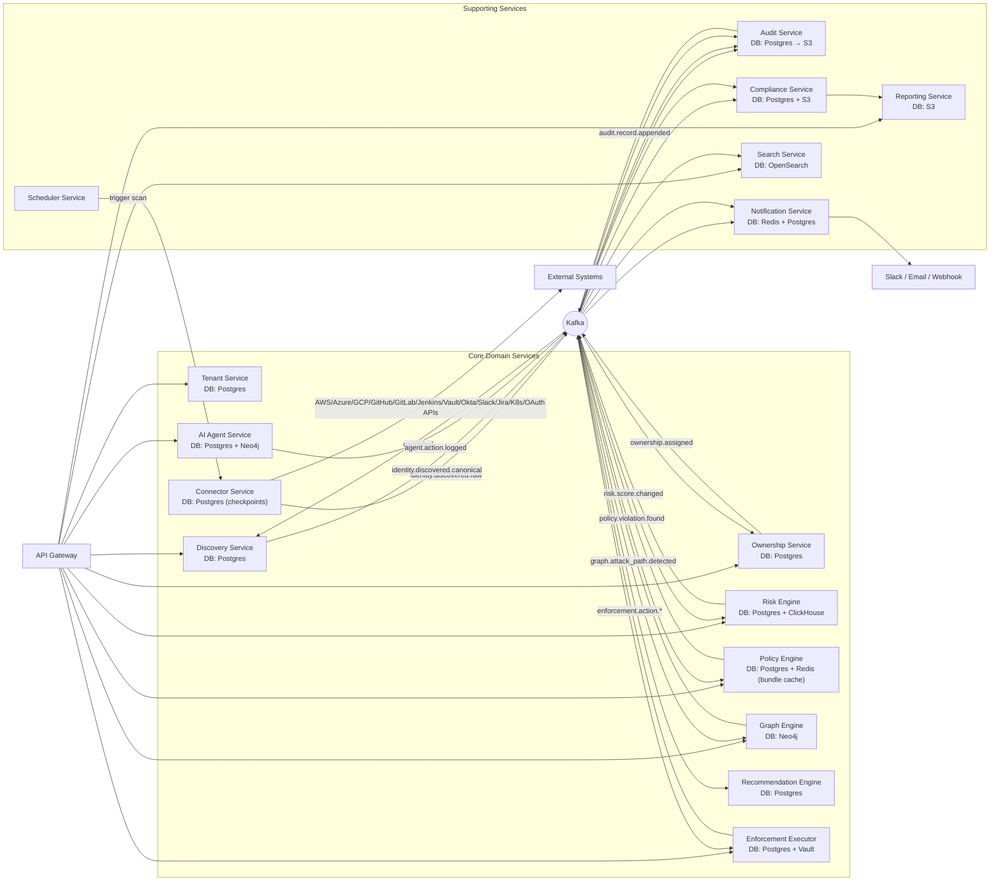

**Explanation**: Kafka is drawn once as a hub because that's the truth of the topology — services don't call each other directly for domain events, they publish/subscribe. Direct arrows (Gateway→service, Connector→External) represent synchronous calls; Kafka arrows represent async domain events.

**Request flow**: Synchronous (user-facing reads/writes) go Gateway→Service→DB directly. Asynchronous (discovery→ownership→risk→graph→policy→enforcement) flows entirely through Kafka, one event hop at a time, matching Section 5's topic taxonomy.

**Failure handling**: Each service's Kafka consumer group fails independently — Graph Engine being down delays attack-path updates but doesn't block Risk Scoring from processing the same event.

**Scaling strategy**: Connector Service and Discovery Service scale with tenant×source count; Enforcement Executor scales with policy-violation volume, kept intentionally smaller/more controlled given its liability profile (fewer, more heavily-reviewed replicas).

**Security notes**: Enforcement Executor is the only service with a live Vault credential-issuance path — drawn deliberately as a dead-end consumer, not a hub, to minimize its blast radius as an attack target.

**Future expansion**: New source types are new Connector Service plugins, not new services — the diagram's shape doesn't change as integrations grow (Section 4's core moat).

---

## 3. Discovery Pipeline

**Purpose**: Full multi-source discovery flow from external system to graph/risk update.

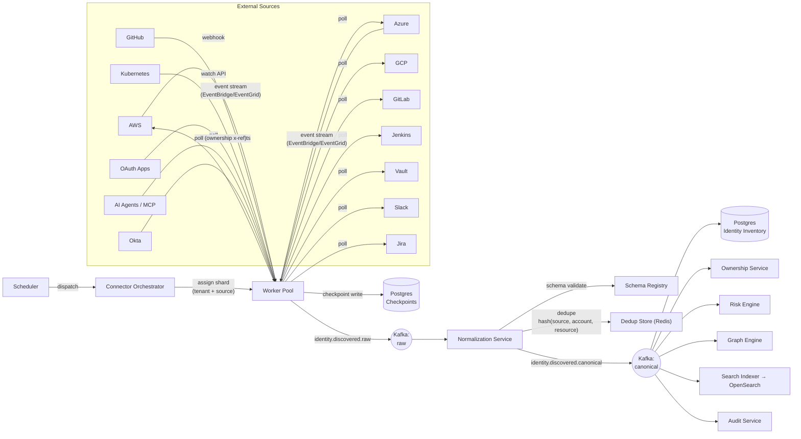

**Explanation**: Collection strategy is source-appropriate, not uniform — polling, event-streams, webhooks, and watch-APIs are all shown feeding the same worker pool, which is the point of the Connector SDK abstraction (Section 4).

**Request flow**: Scheduler dispatch → shard assignment → source-appropriate collection → raw event → normalize/dedupe/validate → canonical event → fan-out to every downstream consumer.

**Failure handling**: Checkpoints commit only after successful Kafka publish (over-produce-safe, under-produce-unsafe design from Section 4) — a crashed worker replays, dedup absorbs the duplicate.

**Scaling strategy**: Sharded by `(tenant_id, source_type)` — isolates noisy tenants and lets per-tenant polling cadence vary by pricing tier (Section 19's cost lever).

**Security notes**: Connectors are read-only by design; credentials to reach customer environments are short-lived, scoped, and never persisted beyond the scan operation.

**Future expansion**: A new AI-agent framework or SaaS platform is a new worker plugin behind the same Orchestrator — no change to Normalization or anything downstream.

---

## 4. Event-Driven Architecture

**Purpose**: Kafka topology — topics, DLQ/retry, schema registry, outbox/inbox patterns.

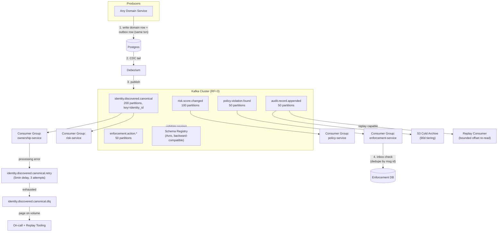

**Explanation**: The outbox pattern (steps 1–3) is what makes "update DB + emit event" atomic without distributed transactions — CDC tails the outbox table rather than the app double-writing to Postgres and Kafka separately.

**Request flow**: Service writes business row + outbox row in one Postgres transaction → Debezium tails the WAL → publishes to Kafka → schema-validated → consumer groups process independently → DLQ/retry topics absorb failures without blocking the partition.

**Failure handling**: Retry topic (delayed redelivery) before DLQ; DLQ triggers paging only past a volume threshold (a single poison message shouldn't wake anyone); every DLQ message is replayable via tooling, never silently dropped.

**Scaling strategy**: Partition counts sized for target throughput (Section 5); consumer group parallelism scales independently per bounded context via KEDA on consumer lag.

**Security notes**: Kafka ACLs scope each service to only the topics it needs to produce/consume; audit topic is append-only with S3 Object Lock at the archive tier for tamper-evidence.

**Future expansion**: New event types are new topics registered in the schema registry with CI-enforced backward compatibility — no coordinated multi-service deploy required.

---

## 5. Database Architecture

**Purpose**: Every datastore, what it owns, and read/write paths between them.

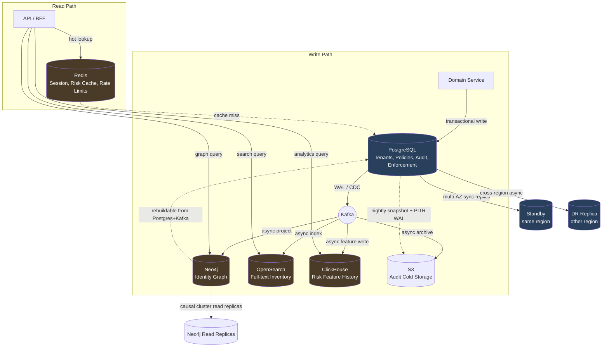

**Explanation**: Blue-tinted stores are CP (Postgres family — strict consistency for policy/audit correctness); amber-tinted are AP-leaning (Redis/Neo4j/OpenSearch/ClickHouse — eventual consistency acceptable, each with a bounded staleness SLA). Neo4j is explicitly rebuildable from Postgres+Kafka, which is why its DR story (Diagram 15) can be "rebuild" instead of "restore."

**Request flow**: Writes always land in Postgres first (source of truth) → CDC fans out asynchronously to every derived store. Reads hit the store purpose-built for the query shape — never Postgres for graph traversal or full-text search.

**Failure handling**: Redis loss is a non-event (rebuild from Postgres cache-aside); Neo4j loss triggers rebuild-from-event-log rather than a traditional restore; Postgres loss fails over to the multi-AZ synchronous standby automatically.

**Scaling strategy**: Postgres sharded by `tenant_id`; Neo4j partitioned per-tenant; ClickHouse partitioned by time+tenant with TTL-based downsampling.

**Security notes**: Envelope encryption keys per-tenant for single-tenant/regulated deployments (Section 12); S3 archive under Object Lock (WORM) for audit immutability.

**Future expansion**: A future Vector DB (if agent-behavior semantic search becomes a real requirement) slots in as another async-projected read store off the same Kafka backbone — no change to the write path.

---

## 6. Identity Graph Architecture

**Purpose**: The graph model itself — nodes, edges, traversal, attack-path/risk-propagation logic.

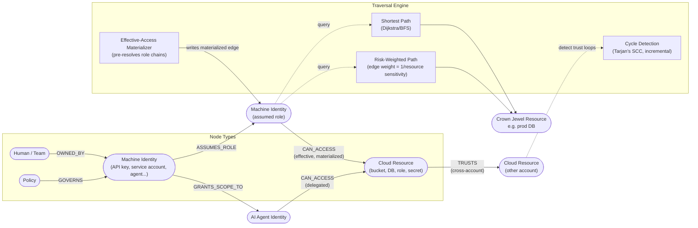

**Explanation**: `CAN_ACCESS` between `MID2` and `RES` is deliberately labeled "materialized" — it's a precomputed, refreshed-on-delta edge representing resolved effective permissions, not a live per-query IAM resolution (Section 7's core performance lever).

**Request flow**: A discovered permission/role-assumption relationship writes graph edges → Effective-Access Materializer resolves inheritance chains into direct edges → Attack Path Explorer queries traverse the materialized graph, not raw chains.

**Failure handling**: Stale materialized edges are timestamped and visibly flagged in the UI if refresh lag exceeds SLA (30s target) — a stale attack-path result is visible, not silently wrong.

**Scaling strategy**: Graph is partitioned per-tenant (no cross-tenant traversal need exists), bounding query cost by one customer's environment size regardless of global graph size.

**Security notes**: `TRUSTS` edges specifically model cross-account trust relationships — the exact hidden-privilege-escalation pattern named in the PRD as hard to govern manually.

**Future expansion**: `GRANTS_SCOPE_TO`/delegated-access edges for AI agents are structurally identical to human OAuth grants — the same traversal engine covers both without special-casing agent identities.

---

## 7. Risk Engine Pipeline

**Purpose**: Discovery-to-recommendation risk scoring flow, rules+ML hybrid.

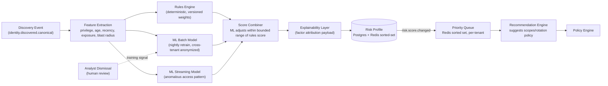

**Explanation**: ML is strictly additive — it adjusts the deterministic rules score within a bounded range rather than replacing it, preserving the explainability the PRD requires for a security product's trust story.

**Request flow**: Every discovery/update event triggers feature extraction → parallel rules + ML scoring → combined, bounded, explained → written to the risk profile → priority queue re-ranked in real time.

**Failure handling**: If ML inference is unavailable, the rules-engine score alone is used (degrades gracefully, never blocks scoring entirely on an ML dependency).

**Scaling strategy**: Redis sorted-set priority queue gives O(log n) re-ranking per tenant — critical at millions of identities per large tenant.

**Security notes**: Analyst feedback is human-reviewed before affecting the shared cross-tenant model, preventing one bad actor/mistake from poisoning risk scoring for other customers.

**Future expansion**: The bounded-adjustment pattern means a future, more sophisticated ML model is a drop-in replacement for `MLBATCH`/`MLSTREAM` without touching the rules engine, explainability layer, or anything downstream.

---

## 8. Policy Enforcement Pipeline

**Purpose**: Risk → policy evaluation → approval → remediation → audit, the highest-liability flow in the system.

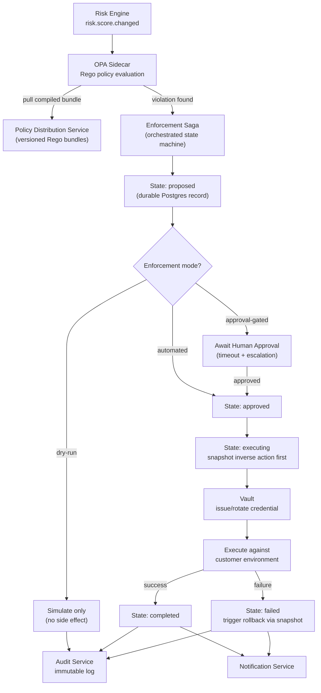

**Explanation**: The saga is orchestrated (not choreographed) specifically because the approval step needs explicit timeout/escalation logic — that's much safer as visible state-machine code than emergent event choreography, given this is the service most likely to cause a customer-visible incident if it misbehaves.

**Request flow**: Policy violation → mode check (dry-run/approval/automated) → for real actions, snapshot the inverse first → execute via Vault-issued short-lived credential → record terminal state → audit + notify unconditionally, success or failure.

**Failure handling**: A failed execution triggers rollback via the pre-captured inverse snapshot; the system biases toward "old credential stays valid a bit longer" over "customer service goes down," per the explicit design principle in Section 3.

**Scaling strategy**: Enforcement Executor intentionally runs fewer, more heavily-reviewed replicas than other services — this is a case where the right scaling strategy is "scale carefully," not "scale maximally."

**Security notes**: Every state transition is a durable, auditable event — never an in-memory-only gate; approval requires an authenticated human action, logged with identity.

**Future expansion**: New action types (beyond rotate/revoke/decommission) plug into the same `S3→Vault→Execute` shape without touching the saga's approval/audit logic.

---

## 9. Authentication and Authorization

**Purpose**: Both customer-facing (OIDC/SAML) and internal service-identity (mTLS/Vault) auth, plus RBAC/ABAC policy evaluation.

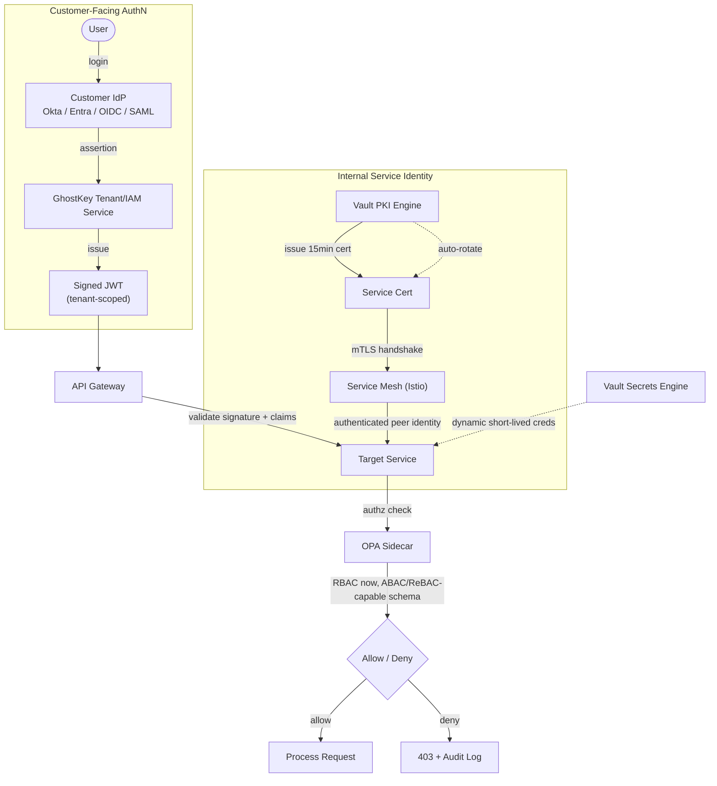

**Explanation**: Two entirely separate auth planes are shown deliberately — customer-facing SSO/JWT never substitutes for internal service identity, and vice versa. Conflating them is a common security-architecture mistake this diagram is designed to make impossible to miss.

**Request flow**: Customer login via their own IdP → GhostKey issues a tenant-scoped JWT → Gateway validates on every request → internal call to the owning service happens over an mTLS connection whose identity is completely independent of the customer's JWT.

**Failure handling**: Expired/invalid JWT → 401 at the gateway, never reaches a service; failed mTLS handshake → connection refused at the mesh layer, request never reaches application code.

**Scaling strategy**: JWT validation is stateless (public-key verification), scales with gateway replica count; Vault PKI issuance scales horizontally behind Vault's own HA cluster.

**Security notes**: No long-lived static credentials anywhere internally; ABAC/ReBAC-capable schema from day one means expanding authorization sophistication later is a policy change, not a data migration.

**Future expansion**: ReBAC (relationship-based) policies — e.g., "a platform engineer can only remediate identities their team owns" — are a Rego policy addition against the existing schema, not new plumbing.

---

## 10. API Flow (with Caching)

**Purpose**: A single request's full path, including cache-check/cache-fill.

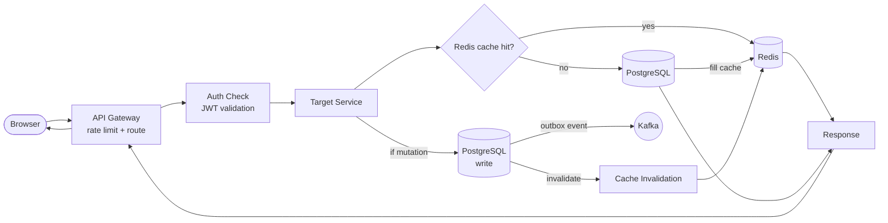

**Explanation**: Reads check Redis first (cache-aside pattern), fill on miss; writes go straight to Postgres and explicitly invalidate the cache rather than trying to update it in place — invalidate-on-write is simpler to reason about and avoids stale-cache bugs.

**Request flow**: Browser→Gateway→Auth→Service→(cache check, hit or miss)→Response; mutations additionally write Postgres and emit an outbox event for async downstream processing.

**Failure handling**: Redis unavailable degrades to "always hit Postgres" — slower, not broken; this is why Redis holds no source-of-truth data (Section 6).

**Scaling strategy**: Redis Cluster for cache horizontal scale; PgBouncer connection pooling in front of Postgres so hundreds of service replicas don't exhaust connection limits.

**Security notes**: Cache keys are tenant-scoped (`tenant_id` prefix) — a cache implementation bug can't leak one tenant's cached data to another.

**Future expansion**: A CDN-edge cache layer for read-heavy, low-sensitivity endpoints (e.g., public API status) could sit ahead of the Gateway if that traffic pattern emerges.

---

## 11. Frontend Architecture

**Purpose**: React/Next.js app structure, data flow, and real-time update path.

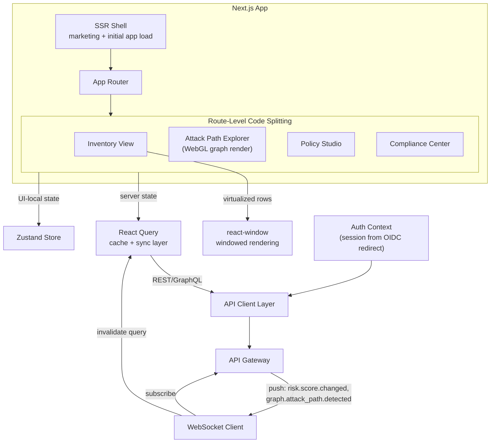

**Explanation**: Server state (anything that came from the API) lives in React Query, not component state or Redux — it's fundamentally cache-and-sync data, not client-authored data, and treating it as such avoids a whole category of staleness bugs.

**Request flow**: Route navigation → React Query fetches/serves cached data → WebSocket push on relevant domain events triggers targeted cache invalidation rather than full page refetch.

**Failure handling**: WebSocket disconnect falls back to React Query's normal polling/refetch-on-focus behavior — real-time is an enhancement, not a hard dependency for correctness.

**Scaling strategy**: Route-level code splitting keeps initial bundle small; virtualization (react-window) is what makes millions-of-identities inventory tables render without freezing the browser.

**Security notes**: Auth context derives strictly from the OIDC redirect flow — no tokens ever live in localStorage; session handled via httpOnly cookies.

**Future expansion**: The Agent Governance Console is structurally just another route under `PAGES` today; only becomes a separate microfrontend if it ships as an independently-versioned product.

---

## 12. Deployment Architecture (AWS)

**Purpose**: Concrete VPC/EKS/network topology.

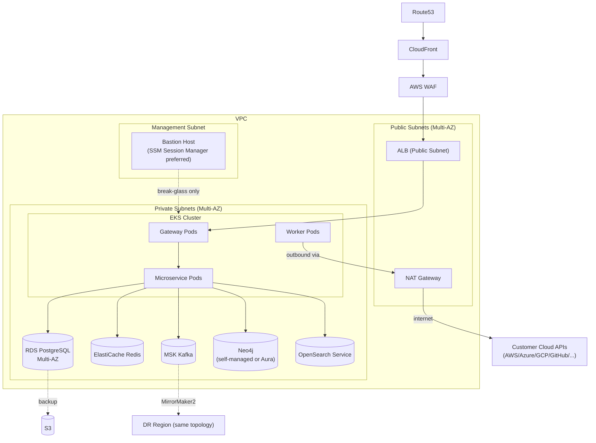

**Explanation**: Nothing stateful is publicly routable — RDS, Redis, Kafka, Neo4j, OpenSearch all live in private subnets, reachable only from EKS pods within the VPC. Bastion is drawn explicitly as break-glass-only; day-to-day access should be SSM Session Manager, not a standing SSH bastion.

**Request flow**: Internet → CloudFront/WAF → public-subnet ALB → private-subnet Gateway pods → private-subnet everything else; outbound connector traffic to customer clouds routes through NAT Gateway.

**Failure handling**: Multi-AZ RDS auto-fails-over; EKS node groups span AZs so an AZ loss drains gracefully with pods rescheduled elsewhere.

**Scaling strategy**: EKS node groups on cluster-autoscaler/Karpenter; NAT Gateway bandwidth monitored specifically since connector egress volume can be substantial at scale.

**Security notes**: Security groups are default-deny between subnets, explicit allow-lists per service; bastion access is logged and time-boxed even for break-glass use.

**Future expansion**: This exact topology replicates per-region for the multi-region DR/global-SaaS end state (Diagram 15), and single-tenant customers get a dedicated VPC of this same shape.

---

## 13. CI/CD Pipeline

**Purpose**: Code-to-production path with progressive delivery.

```mermaid
flowchart LR
    DEV["Developer Push"] --> GH["GitHub<br/>trunk-based, short-lived branches"]
    GH --> ACTIONS["GitHub Actions"]

    ACTIONS --> BUILD["Build"]
    BUILD --> UNIT["Unit Tests"]
    UNIT --> INTEG["Integration + Contract Tests<br/>(Pact-style)"]
    INTEG --> CHAOS{"Enforcement-path change?"}
    CHAOS -->|"yes"| FAULT["Chaos / Fault-Injection Suite"]
    CHAOS -->|"no"| SCAN
    FAULT --> SCAN["Security Scan<br/>SAST + SBOM (Syft/Grype)"]

    SCAN --> SIGN["Sign Image<br/>cosign"]
    SIGN --> REGISTRY["Container Registry<br/>(ECR)"]

    REGISTRY --> ARGOCD["ArgoCD<br/>GitOps sync"]
    ARGOCD --> ADMISSION["Admission Controller<br/>(verify signature + SBOM)"]
    ADMISSION --> CANARY["Argo Rollouts<br/>5% → 25% → 50% → 100%"]

    CANARY -->|"error budget breach"| ROLLBACK["Automatic Rollback"]
    CANARY -->|"healthy"| FULL["Full Rollout"]

    FULL --> RING2["Ring 2: Single-Tenant/Enterprise<br/>(N days after SaaS validation)"]

    CANARY -.->|"metrics"| MON["Monitoring<br/>(feeds rollback decision)"]
```

**Explanation**: The enforcement-path chaos-testing branch is drawn as an explicit conditional gate, not a footnote — matching the PRD's own stated priority that this specific code path deserves fault-injection testing other services don't require.

**Request flow**: Push → build/test/scan/sign → GitOps-synced deploy → canary with automated metric-based promotion or rollback → staged ring rollout to enterprise/single-tenant deployments.

**Failure handling**: Any canary metric breach (error-budget burn rate) triggers automatic rollback before full rollout — no human has to be watching for the common case.

**Scaling strategy**: Pipeline itself scales via GitHub Actions runners; deployment scaling is orthogonal (handled by EKS/HPA per Diagram 12).

**Security notes**: Admission controller enforces signed-image-only, clean-SBOM-only — an unsigned or vulnerable image physically cannot run in the cluster, not just a policy that's supposed to be followed.

**Future expansion**: A third ring (regulated/FedRAMP-track deployments, if pursued) slots in after Ring 2 with its own longer validation window.

---

## 14. Observability Architecture

**Purpose**: Telemetry from application code to on-call paging.

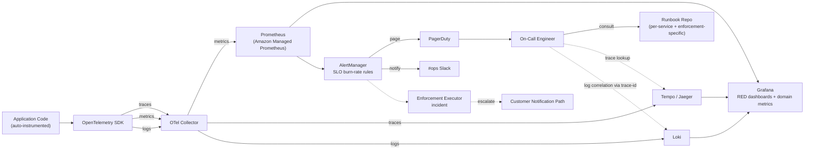

**Explanation**: Every signal carries a shared trace-id, which is what makes the on-call engineer's Grafana→Tempo→Loki jump actually useful instead of three disconnected tools.

**Request flow**: Instrumented code emits all three signal types to a local OTel Collector → routed to purpose-built backends → unified in Grafana → burn-rate alerting pages on-call with a direct trace/log correlation path.

**Failure handling**: Collector runs as a resilient DaemonSet/sidecar with local buffering — a brief backend outage doesn't drop telemetry, it queues.

**Scaling strategy**: Managed Prometheus/backends scale independently of the services they observe; retention tiers (hot vs. long-term) keep query performance fast for recent data.

**Security notes**: Logs are scrubbed of credential material at the SDK/collector level before leaving application memory — a security product's own logs are a plausible secret-leak vector if this isn't enforced.

**Future expansion**: Enforcement Executor incidents specifically escalate to a customer-notification path — this is a domain-specific observability requirement (Section 13) drawn explicitly because generic observability tooling wouldn't do this on its own.

---

## 15. Disaster Recovery

**Purpose**: Multi-region failover topology.

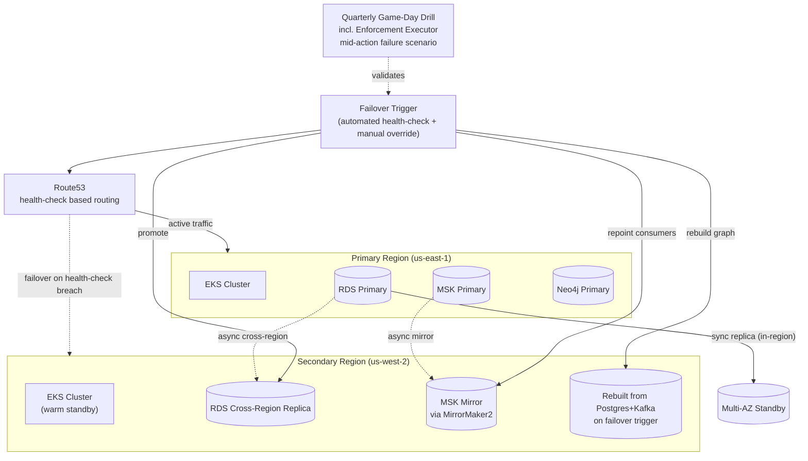

**Explanation**: Neo4j's secondary is drawn as "rebuilt on failover trigger" rather than a continuously-replicated hot standby — a deliberate cost/complexity tradeoff enabled by the graph being a rebuildable projection (Diagram 5), not source-of-truth.

**Request flow**: Normal operation routes 100% to primary; Route53 health checks detect region-level failure → automated failover promotes the RDS replica, repoints Kafka consumers to the mirrored cluster, triggers graph rebuild, and shifts DNS.

**Failure handling**: RTO/RPO targets per failure type are detailed in Section 17 of the architecture doc — this diagram shows the mechanism, the doc shows the numbers.

**Scaling strategy**: Secondary region is warm-standby sized, not fully hot — cost-optimized given true full-region failures are rare relative to component-level failures handled in-region.

**Security notes**: DR failover preserves the same mTLS/Vault trust chain — the secondary region isn't a lower-security fallback path.

**Future expansion**: A true active-active multi-region posture (not just DR) is the natural evolution once cell-based architecture (Section 16 of the doc) is adopted at 100,000+/Global SaaS scale.

---

## 16. Scaling Architecture Evolution

**Purpose**: Architecture shape at each customer-count milestone.

```mermaid
flowchart LR
    S1["Stage 1: 1 Customer<br/>Modular monolith<br/>Single Postgres<br/>In-process events"]

    S2["10 Customers<br/>+ Kafka introduced<br/>Connector Workers split out<br/>Single region"]

    S3["100 Customers<br/>+ Enforcement, Risk, Graph<br/>split into services<br/>+ Redis + ClickHouse<br/>Postgres read replicas"]

    S4["1,000 Customers<br/>Full microservice catalog<br/>Multi-AZ everything<br/>+ OpenSearch<br/>First single-tenant/VPC deploys"]

    S5["10,000 Customers<br/>Multi-region active-passive DR<br/>Sharded Postgres by cohort<br/>Dedicated infra for top accounts"]

    S6["100,000+ / Global SaaS<br/>Cell-based architecture<br/>Multi-region active-active<br/>Regional compliance deployments<br/>(EU residency, GovCloud)"]

    S1 -->|"real event durability<br/>needed for audit trail"| S2
    S2 -->|"write contention on<br/>shared audit/policy tables"| S3
    S3 -->|"large-tenant graph size,<br/>noisy-neighbor discovery load"| S4
    S4 -->|"data residency,<br/>connector API quota limits"| S5
    S5 -->|"cross-region policy consistency,<br/>true global graph scale"| S6

    style S1 fill:#1e3a5f,color:#fff
    style S2 fill:#274a6b,color:#fff
    style S3 fill:#2f5a78,color:#fff
    style S4 fill:#387085,color:#fff
    style S5 fill:#428693,color:#fff
    style S6 fill:#4d9ca1,color:#fff
```

**Explanation**: Each arrow label is the *bottleneck that forces the next stage* — this is a causal evolution, not an arbitrary roadmap; the full cost/bottleneck/optimization detail for each stage lives in Section 16 of the architecture document.

**Request flow**: N/A — this diagram shows architectural state over time, not a runtime request path.

**Failure handling**: Each stage inherits the DR posture appropriate to its scale (Diagram 15 is the Stage 5–6 end state; Stage 1–2 rely on simpler single-region backup/restore).

**Scaling strategy**: The core bounded-context/event-taxonomy design (Diagrams 2–4) does not change across stages — only deployment topology and datastore sharding degree change, which is precisely what makes this evolution tractable instead of a series of rewrites.

**Security notes**: Security posture (mTLS, Vault, audit immutability) is present from Stage 1 — it is not something bolted on at Stage 4+, since retrofitting security into a security product post-hoc is not a credible option.

**Future expansion**: Stage 6's cell-based architecture is itself extensible — new cells for new regions/compliance zones are additive, not a rearchitecture.

---

## Post-Diagram Review

**Bottlenecks / SPOFs found while diagramming** (consistent with Section 20 of the architecture doc, sharpened by actually drawing the flows):

1. **Diagram 3 makes explicit** what was implicit in prose: every single discovery source funnels through one Normalization Service before fan-out. At 1T events this is the one place a bad deploy stalls *everything* downstream — it needs the most conservative rollout ring of any service after Enforcement Executor, which the original doc didn't call out as strongly as it should have.
2. **Diagram 8's saga has a single Postgres-backed state table as its backbone.** That table's write throughput is a real ceiling at 1T-events scale even with `tenant_id` partitioning — worth benchmarking specifically, not assumed away.
3. **Diagram 15 shows Kafka MirrorMaker2 as the only cross-region event bridge.** If the primary region's Kafka cluster fails *before* mirror lag catches up, the secondary's state is behind by whatever that lag was — an honest gap, not fully closed by "async mirror," and worth a tighter RPO commitment only if the business actually needs it (this is a cost/rigor tradeoff, not a free improvement).

**Scores are unchanged from the architecture document's Section 20** — these diagrams are a faithful visualization of that design, not a new design, so I haven't re-scored them separately.
